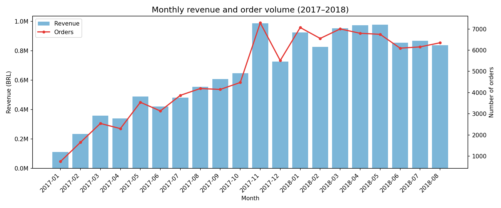
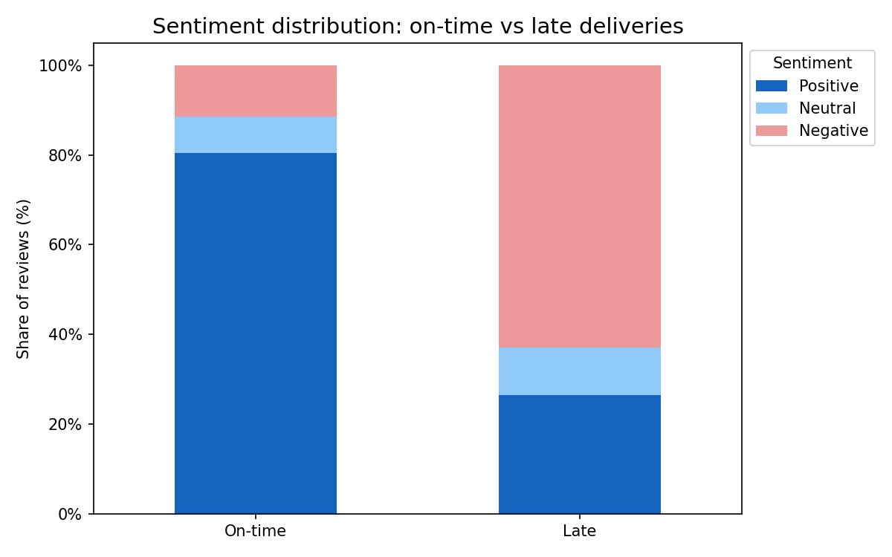
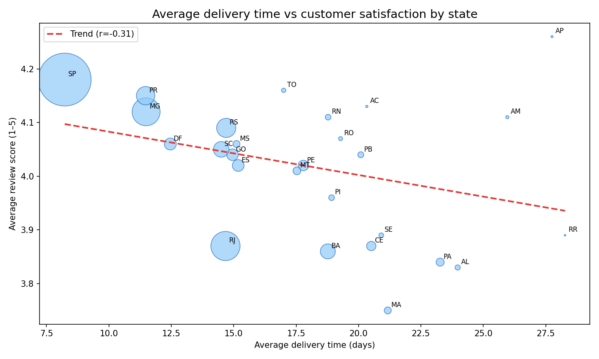
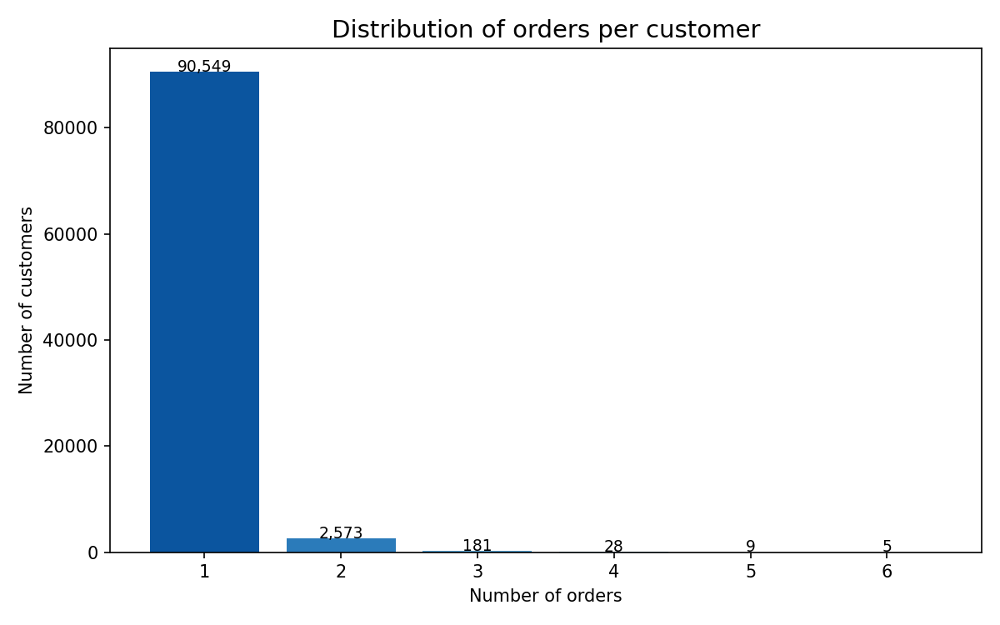
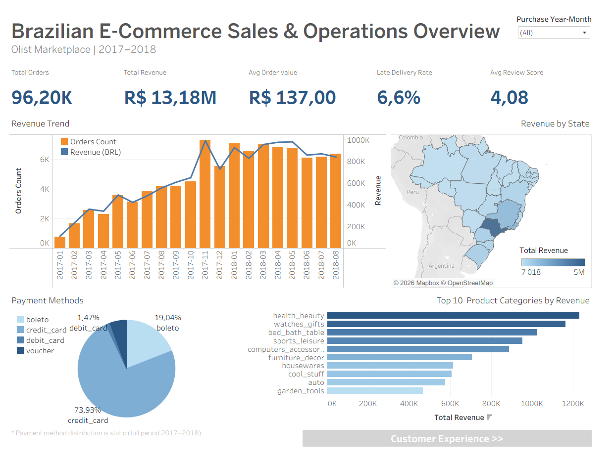
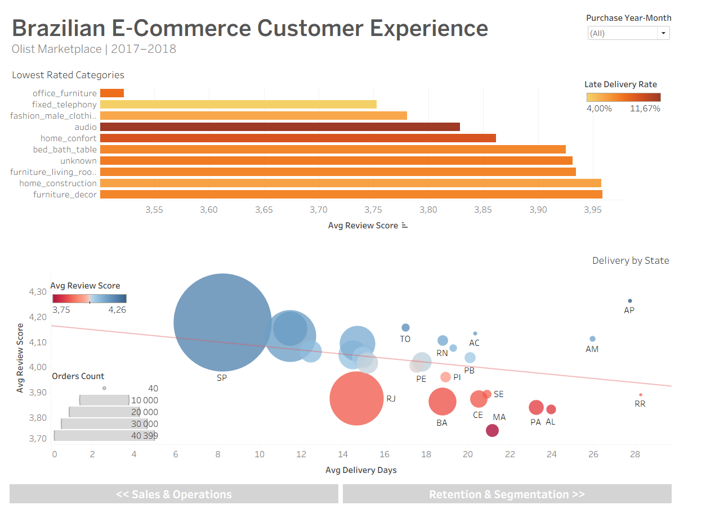
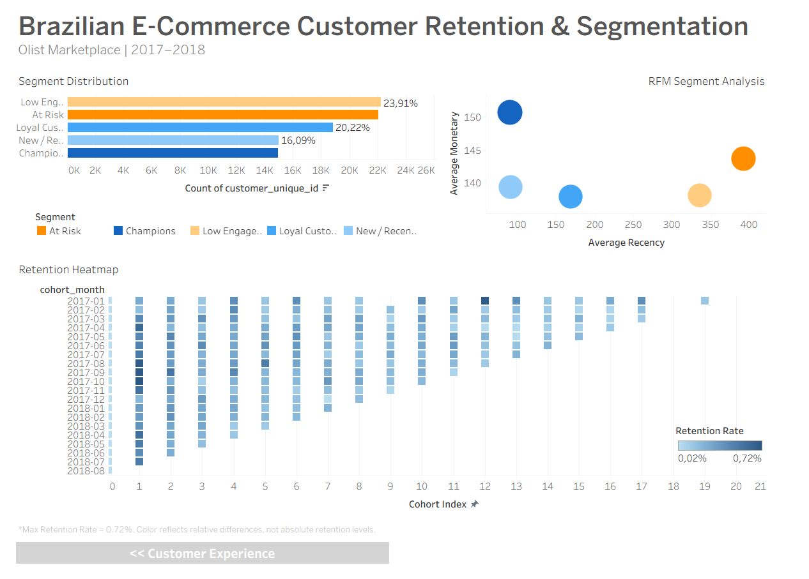

# Brazilian E-Commerce Analysis

End-to-end analytics project based on the Olist Brazilian E-Commerce dataset.
The project analyzes marketplace performance, revenue drivers, delivery operations, customer satisfaction, customer retention, and segmentation. The final output includes a Jupyter Notebook analysis, BigQuery SQL queries, and interactive Tableau dashboards.

## Project Goal
The goal of this project is to analyze Brazilian e-commerce marketplace performance and identify key factors affecting: revenue growth, product category performance, delivery efficiency, customer satisfaction, customer retention, and long-term business opportunities.

## Tools Used
- **Python:** data cleaning, feature engineering, EDA, statistical testing, RFM segmentation, cohort analysis
- **Pandas, Matplotlib, Seaborn, SciPy:** analysis and visualization
- **BigQuery / SQL:** business question validation and analytical queries
- **Tableau Public:** interactive dashboard development

## Dataset
- Source: [Kaggle — Olist Brazilian E-Commerce](https://www.kaggle.com/datasets/olistbr/brazilian-ecommerce)
- 99,441 orders, 8 tables
- Period: September 2016 — August 2018
- Validated analysis period: January 2017 — August 2018
- Scope: orders, customers, sellers, products, payments, reviews, and geographic data

Incomplete historical months were excluded from the main analysis:

`2016-10` — partial first month in the dataset

`2016-12` — only one recorded order

## Project Workflow
1. Data loading and initial exploration
2. Data cleaning and validation
3. Feature engineering
4. Master table creation
5. Business performance analysis
6. BigQuery SQL validation
7. Customer segmentation and cohort analysis
8. Tableau dashboard development
9. Business conclusions and recommendations

## Project Structure

```text
brazilian-ecommerce-analysis/
│
├── data/
│   ├── README.md
│   ├── clean_df.zip
│   ├── cohort_retention_tableau.csv
│   ├── repeat_customers.csv
│   └── rfm.csv
│
├── notebooks/
│   ├── brazilian_e-commerce_project.ipynb   # Full consolidated notebook (all stages combined)
│   ├── 01_data_preparation.ipynb           # Data loading, cleaning, feature engineering, master table
│   ├── 02_business_analysis.ipynb          # Business performance analysis
│   └── 03_retention_segmentation.ipynb     # Customer segmentation and cohort analysis
│
├── queries.sql
│
├── visualizations/
│
└── README.md
```

The analysis is available as a single consolidated notebook (brazilian_e-commerce_project.ipynb) 
and split into three separate files for GitHub preview compatibility.

## Key Business Questions
### Revenue and Sales Performance
- How did revenue and order volume change over time?
- Which product categories generated the most revenue?
- Which states contributed the most to revenue and customer activity?
- Which sellers generated the highest revenue and customer satisfaction?
- Which payment methods were most popular?

### Customer Experience and Logistics
- How did delivery delays affect customer review scores?
- Were late deliveries statistically associated with lower ratings?
- Which states had the longest delivery times?
- Which product categories received the lowest review scores?
  
### Customer Retention and Segmentation
- What share of customers made repeat purchases?
- Which RFM customer segments were the largest?
- How did cohort retention change over time?

## BigQuery SQL Layer

BigQuery was used to answer and validate core business questions using SQL.

The SQL file includes analytical queries for:

- revenue by product category,
- monthly revenue and order volume,
- average delivery time by state,
- revenue contribution by state,
- payment method analysis,
- lowest-rated product categories.

These queries are aligned with the main business sections in the Jupyter Notebook and support the Tableau dashboard datasets.

## Key Findings
### Revenue and Sales
- The platform showed strong growth throughout 2017.
- Revenue peaked in November 2017, likely driven by Black Friday demand.
- By 2018, monthly revenue stabilized at a high level.
- The top product categories included health_beauty, watches_gifts, and bed_bath_table.
- Revenue was geographically concentrated, with São Paulo generating the largest share.




### Customer Experience
- Late deliveries were strongly associated with lower customer review scores.
- On-time deliveries had an average review score of 4.21.
- Late deliveries had an average review score of 2.26.
- A statistical test confirmed that the difference was significant.
- Northern and remote states had longer average delivery times.




### Customer Retention and Segmentation
- Repeat purchase rate was very low at approximately 3%.
- Around 97% of customers purchased only once.
- RFM analysis showed that many customers belonged to Low Engagement or At Risk segments.
- Cohort analysis confirmed weak customer retention across most cohorts.
- The business appeared to rely more on customer acquisition than long-term retention.



## Tableau Dashboard

[View on Tableau Public](https://public.tableau.com/views/BrazilianE-CommerceAnalysis_17790304439800/SalesOperations?:language=en-US&:sid=&:redirect=auth&:display_count=n&:origin=viz_share_link)

### Dashboard pages:

**Sales & Operations Overview**
- KPI cards
- revenue trend
- revenue by state
- top categories
- payment methods
  
**Customer Experience**
- delivery performance by state
- lowest rated categories
  
**Customer Retention & Segmentation**
- segment distribution
- RFM segment analysis
- retention heatmap

### Dashboard Preview







## Business Recommendations
1. Improve logistics in remote regions
Delivery delays have a strong negative effect on review scores, especially in regions with longer delivery times.

2. Strengthen customer retention efforts
Since repeat purchase behavior is very weak, loyalty programs, personalized recommendations, and post-purchase campaigns could improve customer lifetime value.

3. Monitor high-volume sellers with lower ratings
Sellers with strong revenue but weaker customer satisfaction should be reviewed for operational issues.

4. Optimize bulky product categories
Furniture-related categories showed lower satisfaction and longer delivery times,
suggesting opportunities to improve packaging, shipping, and supplier coordination.

5. Reduce geographic concentration risk
Expanding marketing efforts in underrepresented states could support more balanced long-term growth.

6. Prepare for seasonal demand peaks
The November revenue spike suggests that Black Friday and holiday campaigns require strong inventory and logistics planning.

## Author
Nataliia Butenko

**Completed:** May 2026 
